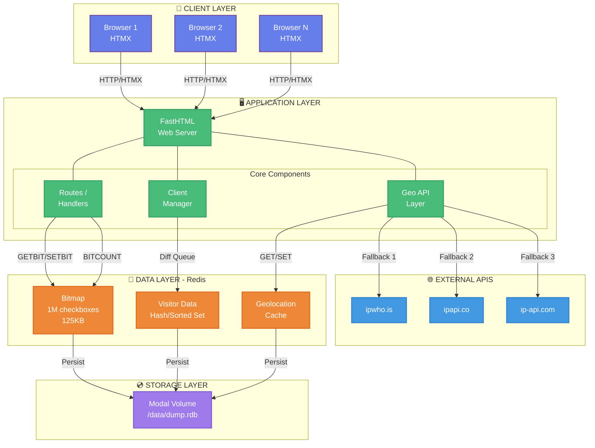
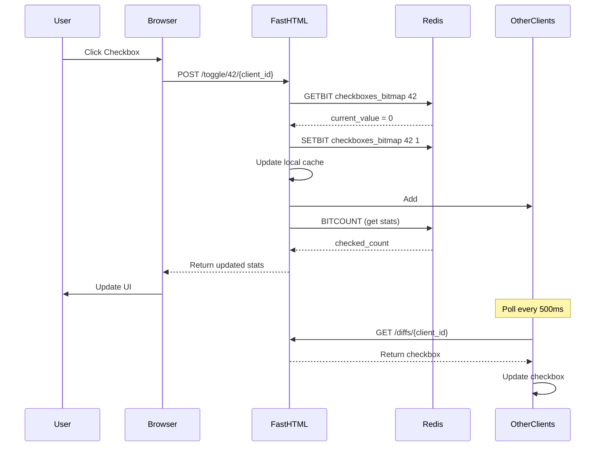
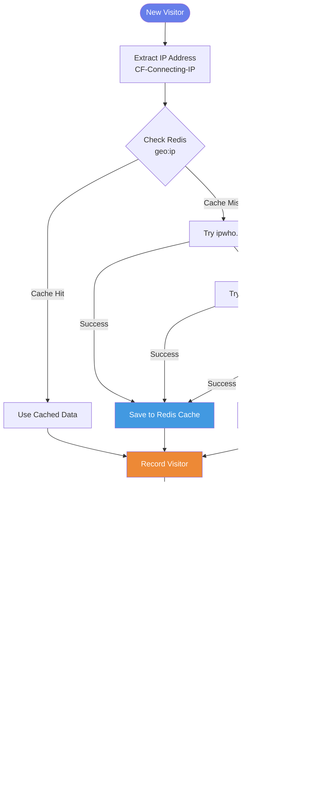
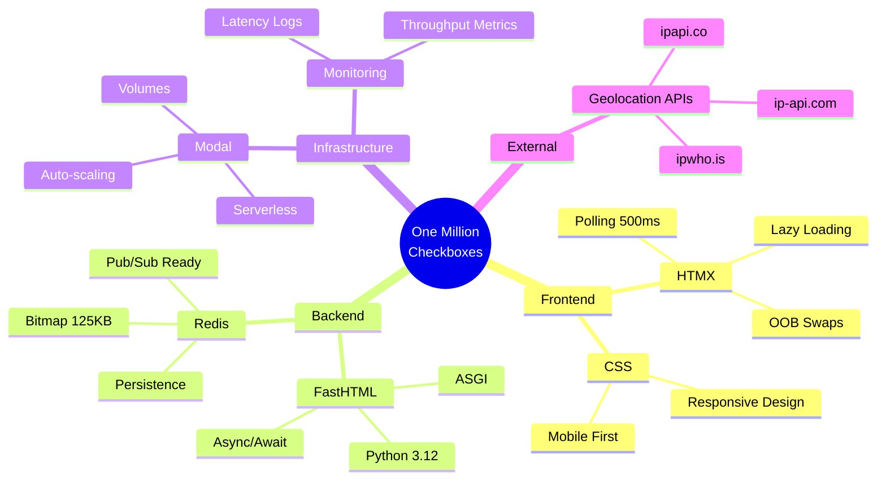
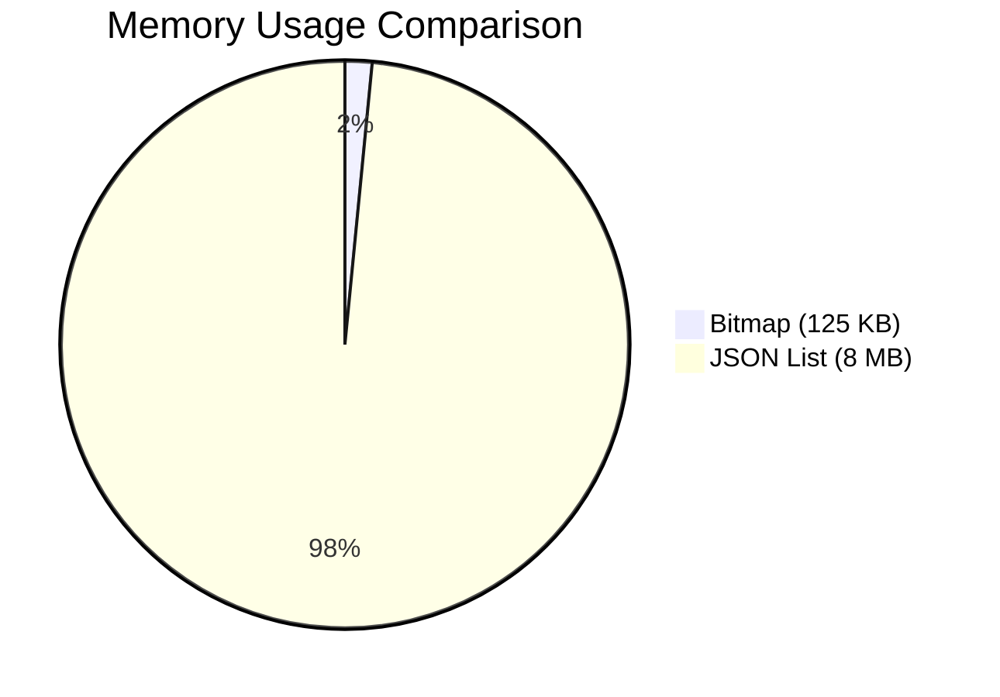

## One Million Checkboxes

One Million checkboxes web app created with 
- FastHtml, 
- deployed with modal serverless and 
- implemented CI/CD with Github Actions.


## Live Deployed One Million Checkboxes
- Link(https://mtm-007--fasthtml-checkboxes-web.modal.run/)

## Design Architecture
┌──────────────────────────────────────────────────────────────────┐
│                          CLIENT LAYER                            │
│   ┌─────────────┐      ┌─────────────┐      ┌─────────────┐      │
│   │  Browser 1  │      │  Browser 2  │      │  Browser N  │      │
│   │   (HTMX)    │      │   (HTMX)    │      │   (HTMX)    │      │
│   └──────┬──────┘      └──────┬──────┘      └──────┬──────┘      │
│          │                    │                    │             │
│          └────────────────────┼────────────────────┘             │
│                               │                                  │
└───────────────────────────────┼──────────────────────────────────┘
                                │ HTTP/HTMX
                                ▼
┌──────────────────────────────────────────────────────────────────┐
│                        APPLICATION LAYER                         │
│  ┌────────────────────────────────────────────────────────────┐  │
│  │                   FastHTML Web Server                      │  │
│  │   ┌──────────────┐  ┌──────────────┐  ┌──────────────┐     │  │
│  │   │    Routes    │  │    Client    │  │   Geo API    │     │  │
│  │   │   Handlers   │  │   Manager    │  │    Layer     │     │  │
│  │   └──────────────┘  └──────────────┘  └──────┬───────┘     │  │
│  └────────────────────────────┬─────────────────┼─────────────┘  │
└───────────────────────────────┼─────────────────┼────────────────┘
                                │                 │
               ┌────────────────┘                 │
               ▼                                  ▼
┌──────────────────────────────┐    ┌──────────────────────────────┐
│     DATA LAYER (Redis)       │    │        EXTERNAL APIS         │
│ ┌──────────────────────────┐ │    │    ┌────────────────────┐    │
│ │  Bitmap (1M checkboxes)  │ │    │    │      ipwho.is      │    │
│ │  Key: checkboxes_bitmap  │ │    │    │      ipapi.co      │    │
│ └──────────────────────────┘ │    │    │      ip-api.com    │    │
│ ┌──────────────────────────┐ │    │    └────────────────────┘    │
│ │  Visitors Data           │ │    └──────────────────────────────┘
│ │  Hash: visitor:{ip}      │ │
│ │  Sorted Set: visitors_log│ │
│ └──────────────────────────┘ │
│ ┌──────────────────────────┐ │
│ │  Geolocation Cache       │ │
│ │  Key: geo:{ip}           │ │
│ └──────────────────────────┘ │
└──────────────┬───────────────┘
               │
               ▼
┌──────────────────────────────┐
│        STORAGE LAYER         │
│ ┌──────────────────────────┐ │
│ │       Modal Volume       │ │
│ │    (Persistent Disk)     │ │
│ │     /data/dump.rdb       │ │
│ └──────────────────────────┘ │
└──────────────────────────────┘


# One Million Checkboxes - System Architecture

## High-Level System Design


## Data Flow: Checkbox Toggle


## Data Flow: Visitor Tracking


## Technology Stack


## Performance Metrics

```mermaid
gantt
    title Request Processing Timeline
    dateFormat X
    axisFormat %L ms
    
    section Checkbox Toggle
    Receive Request    :0, 5
    Get Current State  :5, 25
    Update Redis       :25, 50
    Update Cache       :50, 55
    Notify Clients     :55, 65
    Return Response    :65, 100
    
    section Visitor Tracking
    Extract IP         :0, 5
    Check Cache        :5, 15
    Geo API Call       :crit, 15, 515
    Save to Redis      :515, 540
    Record Visitor     :540, 565
```


```

## How to Use in GitHub:

1. **Create a new file** in your repo: `ARCHITECTURE.md` or add to `README.md`

2. **Paste the Mermaid code** between triple backticks with `mermaid` language tag

3. **GitHub will automatically render** the diagrams when you view the Markdown file

4. **Example structure:**
```
   your-repo/
   ├── README.md
   ├── ARCHITECTURE.md  ← Add diagrams here
   └── docs/
       └── system-design.md