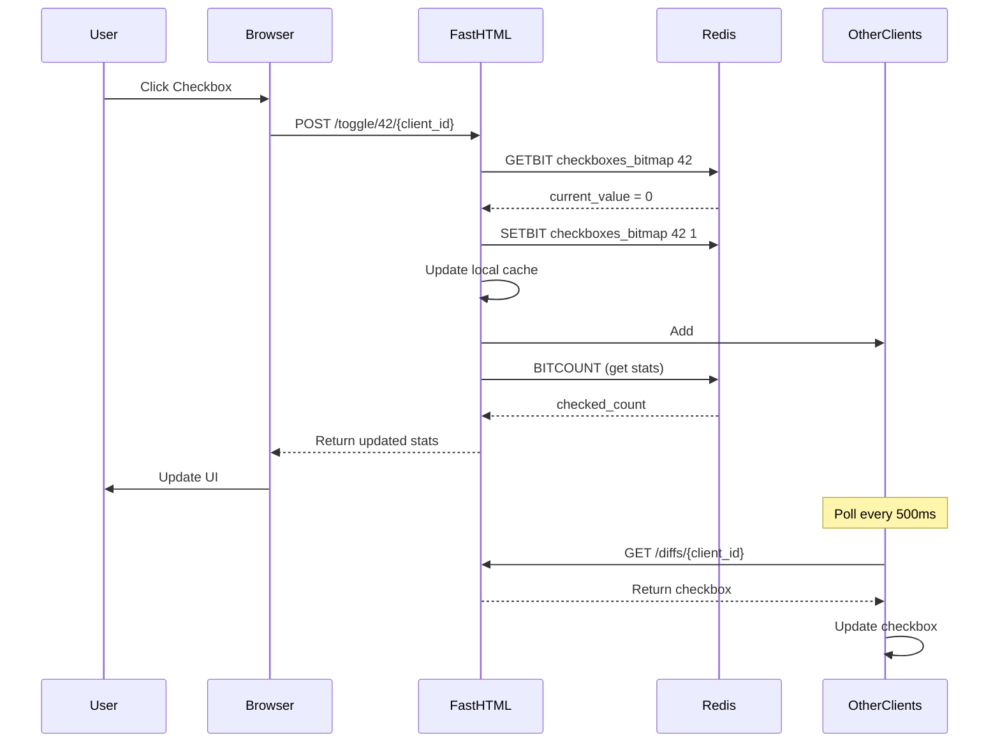
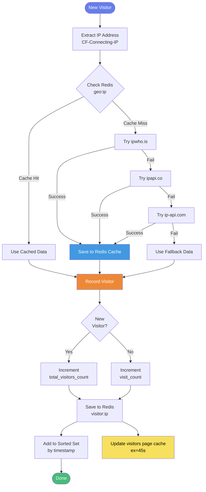
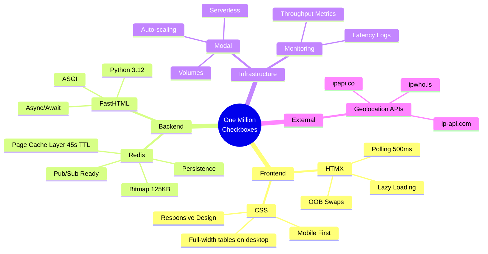
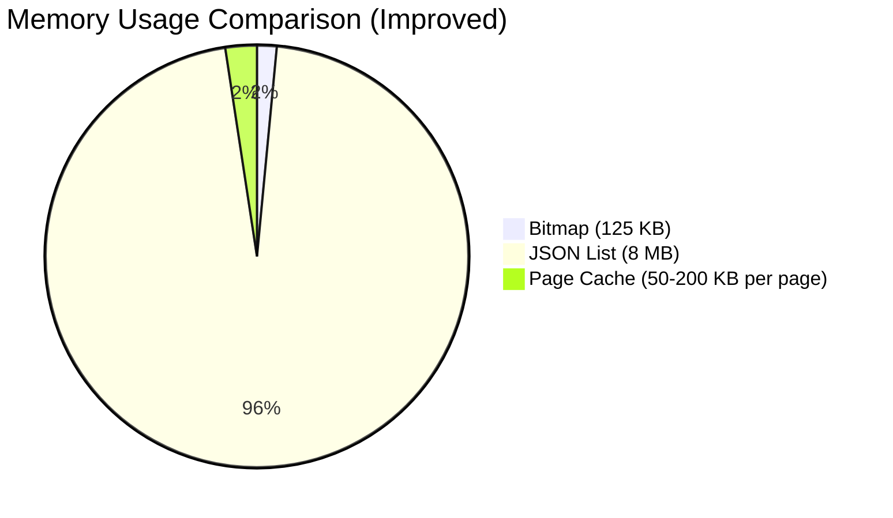

# One Million Checkboxes 🧀

A real-time collaborative **1,000,000-checkbox grid** built with **FastHTML** + **HTMX** + **Redis**, deployed serverlessly on **Modal**.

Click any checkbox → everyone sees it update instantly.

## Live Demo (try it now!)
[](https://mtm-007--fasthtml-checkboxes-web.modal.run/?utm_source=github&utm_medium=readme&utm_campaign=one-million-checkboxes)

(If you're reading this on the GitHub repo — welcome! Click the button/link above to jump straight to the live grid 😄)

### Built With
- **FastHTML** – Pythonic web framework (0.12.x)
- **HTMX** – Lightweight interactivity (polling 500ms + OOB swaps)
- **Redis** – Real-time state (bitmap + visitor/blog data + caching)
- **Modal** – Serverless hosting, auto-scaling (max 3 containers), persistent volumes
- **Starlette** – Low-level ASGI for raw HTML routes (e.g. blog)
- **GitHub Actions** – CI/CD pipeline

### Features
- Real-time collaborative checkboxes (everyone sees changes < 500 ms)
- Persistent state across restarts (Redis RDB + SQLite backup/restore)
- Visitor & referrer analytics dashboard (`/visitors`)
- **Separate blog visitor stats** (`/blog_visitors`) – time spent, scroll depth, actions
- Responsive design (mobile-first, lazy-load 2,000-checkbox chunks)
- Accurate session tracking (heartbeat 10s + beforeunload beacon)
- Detailed persistent logging (`/logs/app.log` with rotation)
- Latency + throughput metrics in logs
- GitHub referrer fix (iframe no-referrer + UTM fallback)

Source code & deploy setup: right here!


# One Million Checkboxes - System Architecture
# System Architecture

## High-Level System Design
```mermaid
graph TD
    subgraph Client_Layer["👥 CLIENT LAYER"]
        B1[Browser 1<br/>HTMX + Responsive CSS]
        B2[Browser 2<br/>HTMX + Responsive CSS]
        BN[Browser N<br/>HTMX + Responsive CSS]
    end
    
    subgraph App_Layer["🖥️ APPLICATION LAYER"]
        FastHTML[FastHTML / Starlette<br/>Web Server]
        
        subgraph Components["Core Components"]
            Routes[Routes / Handlers]
            ClientMgr[Client Manager<br/>(diff queues)]
            GeoAPI[Geo API Layer]
            CacheLayer[Redis Cache Layer<br/>45s TTL for dashboards]
            Metrics[Metrics Middleware<br/>(latency + throughput)]
            Logging[File Logging<br/>(/logs/app.log)]
        end
    end
    
    subgraph Data_Layer["💾 DATA LAYER - Redis"]
        Bitmap[Bitmap<br/>1M checkboxes<br/>125KB]
        Visitor[Visitor Data<br/>Hash + Sorted Set]
        BlogVisitor[Blog Visitor Data<br/>Separate namespace]
        GeoCache[Geolocation Cache]
        PageCache[Page Cache<br/>visitors / referrer stats]
        Sessions[Session Tracking<br/>(heartbeat + beacon)]
    end
    
    subgraph Ext_Layer["🌐 EXTERNAL APIS"]
        API1[ipwho.is]
        API2[ipapi.co]
        API3[ip-api.com]
    end
    
    subgraph Storage_Layer["💿 STORAGE LAYER"]
        Disk[Modal Volume<br/>/data (Redis RDB + SQLite)<br/>/logs (app.log)]
    end
    
    %% Connections (same as before + new)
    B1 -->|HTTP/HTMX| FastHTML
    B2 -->|HTTP/HTMX| FastHTML
    BN -->|HTTP/HTMX| FastHTML
    
    FastHTML --- Routes
    FastHTML --- ClientMgr
    FastHTML --- GeoAPI
    FastHTML --- CacheLayer
    FastHTML --- Metrics
    FastHTML --- Logging
    
    Routes -->|GETBIT/SETBIT/BITCOUNT| Bitmap
    ClientMgr -->|Diff Queue| Visitor
    GeoAPI -->|GET/SET| GeoCache
    CacheLayer -->|GET/SET ex=45s| PageCache
    Metrics -->|Log latency/throughput| Logging
    Sessions -->|Heartbeat + Beacon| Visitor
    Sessions -->|Heartbeat + Beacon| BlogVisitor
    
    GeoAPI -->|Fallback chain| API1
    GeoAPI -->|Fallback chain| API2
    GeoAPI -->|Fallback chain| API3
    
    Bitmap -->|Persist RDB| Disk
    Visitor -->|Persist + SQLite| Disk
    BlogVisitor -->|Persist| Disk
    GeoCache -->|Persist| Disk
    PageCache -->|Ephemeral| Disk
    Logging -->|RotatingFileHandler| Disk
    
    %% Styling (kept original + extras)
    classDef clientStyle fill:#667eea,stroke:#764ba2,stroke-width:2px,color:#fff
    classDef appStyle fill:#48bb78,stroke:#38a169,stroke-width:2px,color:#fff
    classDef dataStyle fill:#ed8936,stroke:#dd6b20,stroke-width:2px,color:#fff
    classDef extStyle fill:#4299e1,stroke:#3182ce,stroke-width:2px,color:#fff
    classDef storageStyle fill:#9f7aea,stroke:#805ad5,stroke-width:2px,color:#fff
    classDef cacheStyle fill:#f6e05e,stroke:#d4c757,stroke-width:2px,color:#000
    classDef metricsStyle fill:#ec4899,stroke:#db2777,stroke-width:2px,color:#fff
    
    class B1,B2,BN clientStyle
    class FastHTML,Routes,ClientMgr,GeoAPI,Metrics,Logging appStyle
    class Bitmap,Visitor,BlogVisitor,GeoCache dataStyle
    class API1,API2,API3 extStyle
    class Disk storageStyle
    class CacheLayer,PageCache,Sessions cacheStyle
    class Metrics metricsStyle
```

## Data Flow: Checkbox Toggle


## Data Flow: Visitor Tracking


## Technology Stack


## Performance Metrics

```mermaid
gantt
    title Request Processing Timeline (Improved)
    dateFormat X
    axisFormat %L ms
    
    section Checkbox Toggle
    Receive Request    :0, 5
    Get Current State  :5, 25
    Update Redis       :25, 50
    Update Cache       :50, 55
    Notify Clients     :55, 65
    Return Response    :65, 100
    
    section Visitor Tracking
    Extract IP         :0, 5
    Check Cache        :5, 15
    Geo API Call       :crit, 15, 515
    Save to Redis      :515, 540
    Check/Update Page Cache :540, 550
    Record Visitor     :550, 565
    
    section Visitors Dashboard
    Check Cache        :0, 10
    Cache Hit - Fast Render :10, 80
    Cache Miss - Full Compute :10, 4000
```

