# One Million Checkboxes 🧀

A real-time collaborative **1,000,000-checkbox grid** built with **FastHTML** + **HTMX** + **Redis**, deployed serverlessly on **Modal**.

Click any checkbox → everyone sees it update instantly.

## Live Demo (try it now!)
[](https://mtm-007--fasthtml-checkboxes-web.modal.run/?utm_source=github&utm_medium=readme&utm_campaign=one-million-checkboxes)

(If you're reading this on the GitHub repo — welcome! Click the button/link above to jump straight to the live grid 😄)

### Built With
- **FastHTML** – Pythonic web framework
- **HTMX** – Lightweight interactivity
- **Redis** – Real-time state + bitmap for 1M checkboxes
- **Modal** – Serverless hosting & scaling
- **GitHub Actions** – CI/CD pipeline

### Features
- Real-time collaborative checkboxes (everyone sees changes)
- Persistent state across restarts
- Visitor & referrer analytics dashboard (`/visitors`)
- Responsive design (mobile + desktop)

Source code & deploy setup: right here in this repo!

# One Million Checkboxes - System Architecture

## High-Level System Design

```mermaid
graph TD
    subgraph Client_Layer["👥 CLIENT LAYER"]
        B1[Browser 1<br/>HTMX + Responsive CSS]
        B2[Browser 2<br/>HTMX + Responsive CSS]
        BN[Browser N<br/>HTMX + Responsive CSS]
    end
    
    subgraph App_Layer["🖥️ APPLICATION LAYER"]
        FastHTML[FastHTML<br/>Web Server]
        
        subgraph Components["Core Components"]
            Routes[Routes /<br/>Handlers]
            ClientMgr[Client<br/>Manager]
            GeoAPI[Geo API<br/>Layer]
            CacheLayer[Redis Cache Layer<br/>45s TTL for heavy pages<br>e.g. /visitors]
        end
    end
    
    subgraph Data_Layer["💾 DATA LAYER - Redis"]
        Bitmap[Bitmap<br/>1M checkboxes<br/>125KB]
        Visitor[Visitor Data<br/>Hash/Sorted Set]
        GeoCache[Geolocation<br/>Cache]
        PageCache[Page Cache<br/>visitors dashboard<br>referrer stats<br>etc.]
    end
    
    subgraph Ext_Layer["🌐 EXTERNAL APIS"]
        API1[ipwho.is]
        API2[ipapi.co]
        API3[ip-api.com]
    end
    
    subgraph Storage_Layer["💿 STORAGE LAYER"]
        Disk[Modal Volume<br/>/data/dump.rdb + SQLite]
    end
    
    %% Client to Application
    B1 -->|HTTP/HTMX| FastHTML
    B2 -->|HTTP/HTMX| FastHTML
    BN -->|HTTP/HTMX| FastHTML
    
    %% Application to Components
    FastHTML --- Routes
    FastHTML --- ClientMgr
    FastHTML --- GeoAPI
    FastHTML --- CacheLayer
    
    %% Components to Data Layer
    Routes -->|GETBIT/SETBIT| Bitmap
    Routes -->|BITCOUNT| Bitmap
    ClientMgr -->|Diff Queue| Visitor
    GeoAPI -->|GET/SET| GeoCache
    CacheLayer -->|GET/SET ex=45s| PageCache
    
    %% Geo API to External
    GeoAPI -->|Fallback 1| API1
    GeoAPI -->|Fallback 2| API2
    GeoAPI -->|Fallback 3| API3
    
    %% Data to Storage
    Bitmap -->|Persist| Disk
    Visitor -->|Persist| Disk
    GeoCache -->|Persist| Disk
    PageCache -->|Ephemeral (optional persist)| Disk
    
    %% Styling
    classDef clientStyle fill:#667eea,stroke:#764ba2,stroke-width:2px,color:#fff
    classDef appStyle fill:#48bb78,stroke:#38a169,stroke-width:2px,color:#fff
    classDef dataStyle fill:#ed8936,stroke:#dd6b20,stroke-width:2px,color:#fff
    classDef extStyle fill:#4299e1,stroke:#3182ce,stroke-width:2px,color:#fff
    classDef storageStyle fill:#9f7aea,stroke:#805ad5,stroke-width:2px,color:#fff
    classDef cacheStyle fill:#f6e05e,stroke:#d4c757,stroke-width:2px,color:#000
    
    class B1,B2,BN clientStyle
    class FastHTML,Routes,ClientMgr,GeoAPI appStyle
    class Bitmap,Visitor,GeoCache dataStyle
    class API1,API2,API3 extStyle
    class Disk storageStyle
    class CacheLayer,PageCache cacheStyle
```

## Data Flow: Checkbox Toggle


## Data Flow: Visitor Tracking


## Technology Stack
```mermaid
mindmap
  root((One Million<br/>Checkboxes))
    Frontend
      HTMX
        Polling 500ms
        Lazy Loading
        OOB Swaps
      CSS
        Responsive Design
        Mobile First
        Full-width tables on desktop
    Backend
      FastHTML
        Python 3.12
        Async/Await
        ASGI
      Redis
        Bitmap 125KB
        Pub/Sub Ready
        Persistence
        **Page Cache Layer (45s TTL) ### NEW**
    Infrastructure
      Modal
        Serverless
        Auto-scaling
        Volumes
      Monitoring
        Latency Logs
        Throughput Metrics
    External
      Geolocation APIs
        ipwho.is
        ipapi.co
        ip-api.com
```

## Performance Metrics

```mermaid
pie title Memory Usage Comparison (Improved)
    "Bitmap (125 KB)" : 125
    "JSON List (8 MB)" : 8000
    "Page Cache (~50–200 KB per page)" : 200 
```

```mermaid
gantt
    title Request Processing Timeline (Improved)
    dateFormat X
    axisFormat %L ms
    
    section Checkbox Toggle
    Receive Request    :0, 5
    Get Current State  :5, 25
    Update Redis       :25, 50
    Update Cache       :50, 55
    Notify Clients     :55, 65
    Return Response    :65, 100
    
    section Visitor Tracking
    Extract IP         :0, 5
    Check Cache        :5, 15
    Geo API Call       :crit, 15, 515
    Save to Redis      :515, 540
    Check/Update Page Cache :540, 550 
    Record Visitor     :550, 565
    
    section Visitors Dashboard
    Check Cache Hit    :0, 10 
    Cache Hit → Fast Render :10, 80
    Cache Miss → Full Compute :10, 3000–5000
```


```
